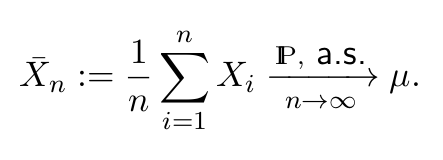
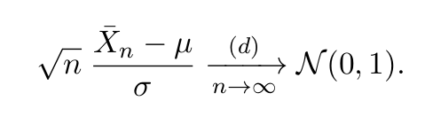

# MIT6.0002-Introduction-to-Computational-Thinking-and-Data-Science

## Data Science and Statistics with Python
  
This course is composed of three main topics; 
* optimization, 
* stochastic thinking, and 
* modelling. 

While applying them in python, you gain also good coding practice with python. 

## Optimization

In the first part, I learn about what is objective function, what are the constraints while optimizing the result. To do optimization, I learn different algorithms; such as greedy algorithm, search tree algorithm. I learned how to implement them recursively, how to make them more efficient by dynamic programming.
  
## Statistics

In stochastic thinking part, we always used random library. The topic is mostly all about Central Limit Theorem. Given sufficiently large samples, the means of each samples is normally distributed, also mean of this normal distribution is close to mean of population. There is also 3rd rule which is used when we have only 1 sample set.We can compute SEM value( it corresponds to std dev of many sample sets), by this we can find confidence interval. I learned also about Monte Carlo simulation, random walks. I implemented them in assignments.
  
( UPDATE ) Now i now how to define all process in mathematical notation thanks to [this course from Prof. Philippe Rigollet](https://ocw.mit.edu/courses/mathematics/18-650-statistics-for-applications-fall-2016/index.htm). One big formula to never forget was **when you see expectation, turn it into average**. Here is the formula for LLN:

Here *X_n* is our statistic. It is measurable function of data. It is random variable. As sample size goes to infinite, it becomes true mean. 

We have our statistic. It is random var which resembles sample means. If n is large enough, this formula turn into normal distribution. This is our pivotal distribution. This structure recurs all the time in statistics, turn random var into something we know everything about it. We know everything about normal distribution so we could generate confidence intervals, we could do hypothesis testing. 

## Some Data Science
Last part of the course is about understanding and modelling the experimental data, what can go wrong with our models, how to test our models. I learned how to implement linear regression. There are also sections about Machine Learning. I learned about clustering and classification, their algorithic solutions. At last there is section devoted to statistical sins, how to deceive people with your data.
  
I thanks to MIT for making such lessons online.
